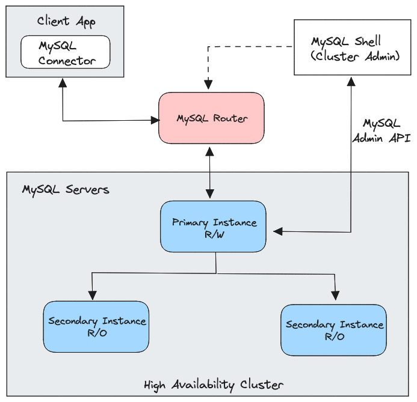

# MySQL (InnoDB)

[TOC]

## Architektur
<figure markdown>
  
</figure>

!!! warning
    **Voraussetzungen:** Es wird davon ausgegangen, dass MySQL Version >= 8 verwendet wird. Des Weiteren ist es zwingend notwendig, dass
    der MySQL Server vollständig auf den [InnoDB Storage Engine](https://dev.mysql.com/doc/refman/8.0/en/innodb-storage-engine.html) läuft und
    die [GTIDs (Global Transaction Identifiers)](https://dev.mysql.com/doc/refman/8.0/en/replication-gtids.html) aktiviert sind.

InnoDB ist ein Stack von MySQL Features, die es ermöglichen ein hochverfügbares und ausfallsicheres Cluster zu erstellen.
Dieses Cluster besteht aus folgenden Komponenten:

- [MySQL Shell](https://dev.mysql.com/doc/mysql-shell/8.0/en/)
- [MySQL Group Replication](https://dev.mysql.com/doc/refman/8.0/en/group-replication.html)
- [MySQL Router](https://dev.mysql.com/doc/mysql-router/8.0/en/)

### MySQL Shell
Die MySQL Shell ist ein CLI Tool, dass einen größeren Funktionsumfang mitbringt, als der normale MySQL Client.
Mit Hilfe der MySQL Shell können wir die InnoDB inkl. der Group Replication initialisieren und verwalten.

### MySQL Group Replication
Die MySQL Group Replication ist eine von mehreren Replikationstypen. Nach das Cluster initialisiert wurde, führen
die Cluster-Nodes eigenständig ein Quorum aus und bestimmten automatisch einen Primary. Sollte der Primary ausfallen,
wird ein gesunder Node des Clusters zum neuen Primary automatisch ernannt. Die Group Replication kann sowohl als Single-Primary,
als auch als Multi-Primary betrieben werden. Für unsere Fälle verwenden wir ausschließlich Single-Primary.

### MySQL Router
Der MySQL Router ist eine leichtgewichtige Middleware, die zwischen der Applikation und der MySQL Datenbank fungiert.
Der Router ist mit dem InnoDB Cluster verbunden und weiß zu jeder Zeit die aktuelle Topologie des Clusters.
Die Applikation sendet ihre SQL Anfragen an den Router. Der Router leitet diese Anfragen an die entsprechenden MySQL Server weiter.

## Installation
### InnoDB Cluster
Es wird davon ausgegangen, dass eine übliche MySQL Installation(inkl. Mysql Shell) auf allen Servern durchgeführt wurde.
Folgende Konfigurationen sind für die InnoDB und die Group Replication notwendig:

```ini
[mysqld]
server-id = 1
gtid_mode = ON
enforce_gtid_consistency = true
disabled_storage_engines="MyISAM,BLACKHOLE,FEDERATED,ARCHIVE,MEMORY"
plugin_load_add='group_replication.so'
group_replication_group_name="aaaaaaaa-aaaa-aaaa-aaaa-aaaaaaaaaaaa" # random UUID die das Cluster eindeutig macht
group_replication_start_on_boot=off
group_replication_local_address= "<meine-ip>:33061"
group_replication_group_seeds= "<ip-db-1>:33061,<ip-db-2>:33061,<ip-db-3>:33061"
group_replication_bootstrap_group=off
binlog_transaction_dependency_tracking="WRITESET"
```

Zunächst verbinden wir uns als root via MySQL Client mit dem ersten Server, der zukünftig der Primary werden soll.

```shell
# Auf dem Primary
mysql -u root -p
```

Hier bearbeiten wir die Rechte für den Benutzer root, damit wir in den folgenden Schritten das InnoDB Cluster initialisieren können.
Wir dieser Schritt übersprungen, so kann sich die MySQL Shell nicht mit der Datenbank verbinden.

```sql
-- Auf dem Primary
USE mysql;
UPDATE user SET Host='%' WHERE user='root';
GRANT CLONE_ADMIN, CONNECTION_ADMIN, GROUP_REPLICATION_ADMIN, PERSIST_RO_VARIABLES_ADMIN, REPLICATION_APPLIER, REPLICATION_SLAVE_ADMIN, ROLE_ADMIN, SYSTEM_VARIABLES_ADMIN ON *.* TO 'root'@'%' WITH GRANT OPTION;
FLUSH PRIVILEGES;
```

Als Nächstes starten wir die MySQL Shell auf dem zukünftigen Primary:

```shell
# Auf dem Primary
mysqlsh
```

Innerhalb der Shell geben wir folgende Befehle ein, um das InnoDB Cluster zu initialisieren. Zusätzlich erstellen wir
einen dedizierter User `clusteradmin`, der im Folgenden verwenden wird, um das Cluster zu konfigurieren.

```js
// Auf dem Primary
dba.configureLocalInstance("root@localhost:3306");
shell.connect('root@db-mysql-test-1.my-domain.lan:3306');
cluster = dba.createCluster('my_innodb_cluster');
cluster.status();
cluster.setupAdminAccount('clusteradmin');
```

Bevor wir die Secondaries in das neue Cluster einbinden, müssen wir den User `clusteradmin` auf den Secondaries vorbereiten.

```shell
# Auf den Secondaries
mysql -u root -p
```

```sql
-- Auf den Secondaries
CREATE USER 'clusteradmin'@'%' IDENTIFIED BY 'mein-clusteradmin-password';
GRANT CONNECTION_ADMIN, GROUP_REPLICATION_ADMIN, REPLICATION_SLAVE_ADMIN, ROLE_ADMIN ON *.* TO 'clusteradmin'@'%' WITH GRANT OPTION;
GRANT DELETE, INSERT, UPDATE ON mysql.* TO 'clusteradmin'@'%' WITH GRANT OPTION;
GRANT ALTER, ALTER ROUTINE, CREATE, CREATE ROUTINE, CREATE TEMPORARY TABLES, CREATE VIEW, DELETE, DROP, EVENT, EXECUTE, INDEX, INSERT, LOCK TABLES, REFERENCES, SHOW VIEW, TRIGGER, UPDATE ON mysql_innodb_cluster_metadata.* TO 'clusteradmin'@'%' WITH GRANT OPTION;
GRANT ALTER, ALTER ROUTINE, CREATE, CREATE ROUTINE, CREATE TEMPORARY TABLES, CREATE VIEW, DELETE, DROP, EVENT, EXECUTE, INDEX, INSERT, LOCK TABLES, REFERENCES, SHOW VIEW, TRIGGER, UPDATE ON mysql_innodb_cluster_metadata_bkp.* TO 'clusteradmin'@'%' WITH GRANT OPTION;
GRANT ALTER, ALTER ROUTINE, CREATE, CREATE ROUTINE, CREATE TEMPORARY TABLES, CREATE VIEW, DELETE, DROP, EVENT, EXECUTE, INDEX, INSERT, LOCK TABLES, REFERENCES, SHOW VIEW, TRIGGER, UPDATE ON mysql_innodb_cluster_metadata_previous.* TO 'clusteradmin'@'%' WITH GRANT OPTION;
GRANT CLONE_ADMIN, CONNECTION_ADMIN, CREATE USER, EXECUTE, FILE, GROUP_REPLICATION_ADMIN, PERSIST_RO_VARIABLES_ADMIN, PROCESS, RELOAD, REPLICATION CLIENT, REPLICATION SLAVE, REPLICATION_APPLIER, REPLICATION_SLAVE_ADMIN, ROLE_ADMIN, SELECT, SHUTDOWN, SYSTEM_VARIABLES_ADMIN ON *.* TO 'clusteradmin'@'%' WITH GRANT OPTION;
```

Nun können wir auf dem Primary innerhalb der MySQL Shell die Secondary Server einbinden.

```js
// Auf dem Primary
cluster.addInstance('clusteradmin@db-mysql-test-2.my-domain.lan:3306',{password: 'mein-clusteradmin-password'});
cluster.addInstance('clusteradmin@db-mysql-test-3.my-domain.lan:3306',{password: 'mein-clusteradmin-password'});
```

### MySQL Router
Es wird davon ausgegangen, dass der MySQL Router via Puppet installiert wird.
Es ist ratsam den MySQL Router und die (PHP-)Applikation auf dem gleichen Server zu installieren. Befindet sich die
Applikation und der Router auf dem gleichen Server, so kann die Applikation ihre SQL Abfrage nach `localhost` senden.

Zunächst wechseln wir zum unprivilegierten User `mysqlrouter`

```shell
su - mysqlrouter -s /bin/bash
```

Anschließend starten wir das Bootstrapping. Der `--directory` Parameter erstellt dabei einen Ordner für die Konfigurationen.
Wir müssen darauf achten, dass der User `mysqlrouter` die notwendigen Rechte zum Erstellen des Ordner besitzt.

```bash
mysqlrouter --bootstrap clusteradmin@db-mysql-test-1.my-domain.lan:3306 --directory /var/lib/mysqlrouter/my_innodb_cluster
```

Jetzt können wir mit dem generierten Start-Skript den MySQL Router hochfahren.

```shell
./var/lib/mysqlrouter/my_innodb_cluster/start.sh
```

**Verbindung testen**

Jetzt können wir überprüfen, ob wir mit Hilfe des Routers eine SQL Abfrage an das InnoDB Cluster senden können.

```shell
mysql -u mein-unpriv-user -p -h 127.0.0.1 -P 6446 -e 'select user(), @@hostname, @@read_only, @@super_read_only'
```

Folgende Antwort sollte zurückkommen:

```
+--------------------------------+-----------------+-------------+-------------------+
| user()                         | @@hostname      | @@read_only | @@super_read_only |
+--------------------------------+-----------------+-------------+-------------------+
| mein-unpriv-user@192.168.0.103 | db-mysql-test-1 |           0 |                 0 |
+--------------------------------+-----------------+-------------+-------------------+
```

## Wartungsarbeiten
### Mit dem Cluster verbinden
!!! warning
    Für alle folgenden Befehle wird davon ausgegangen, dass eine Datenbankverbindung via `mysqlsh` hergestellt wurde.

Um Befehle für Wartungsarbeiten durchzuführen, muss zunächst eine Datenbankverbindung via `mysqlsh` hergestellt werden.

```
mysqlsh
shell.connect('root@db-mysql-test-1.my-domain.lan:3306');
```

### Cluster Status
Der allgemeine Cluster Status lässt folgendermaßen anzeigen:

```
cluster = dba.getCluster();
cluster.status()
```

```
cluster.describe()
```

### Primary Switch-Over
```
cluster.setPrimaryInstance("db-mysql-test-2:3306");
```

### Cluster hoch- und runterskalieren
Knoten hinzufügen

```
cluster.addInstance("db-mysql-test-4.my-domain.lan:3306")
```

Knoten entfernen
```
cluster.removeInstance("db-mysql-test-4.my-domain.lan:3306")
```

### Cluster Auto-Rejoin anpassen
Dieser Wert legt fest, wie oft versucht wird einen verloren gegangenen Knoten automatisch in das Cluster wieder aufzunehmen.
Ein guter Wert ist z.Bsp. 3

```
cluster.setOption("autoRejoinTries", 3)
```
