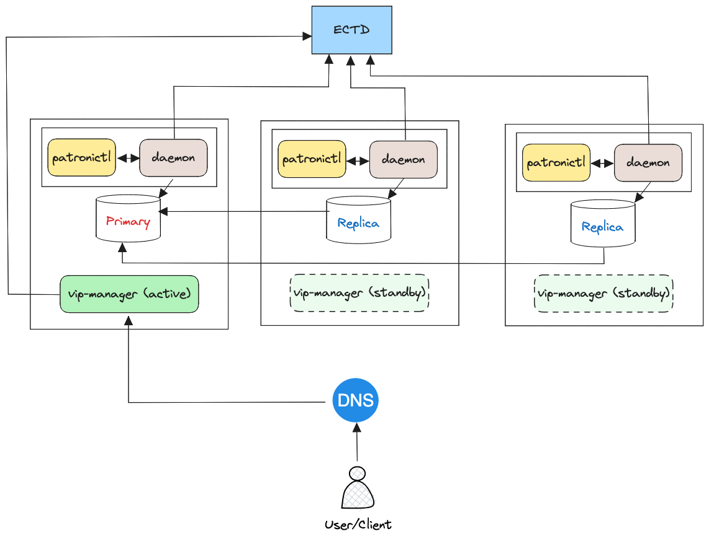

# PostgreSQL (Patroni)

[TOC]

## Was ist Patroni?
<figure markdown>
  
</figure>

[Patroni](https://patroni.readthedocs.io/) ist eine Open Source Cluster-Technologie, die für eine automatische
Ausfallsicherung einer PostgreSQL-Datenbank sorgt.
Die _Patroni_ HA (high availabilty) Cluster sind einfach einzurichten und handzuhaben.
_Patroni_ ist eine Hochverfügbarkeitslösung für PostgreSQL mit einem Fokus
auf Container-Technologie.

!!! info "Distributed Configuration Store"
    _Patroni_ verwendet einen _Distributed Configuration Store_ (DCS).
    Wir verwenden als DCS [etcd](../etcd). Entsprechend muss dieser Dienst vorher
    eingerichtet werden.

## Installation

Auf jedem Knoten, wo PostgreSQL laufen soll, wird auch _Patroni_ eingerichtet.

Zuerst wird das Paket `postgresql-common` installiert, um zu verhindern, dass
bei der Installation des Datenbankservers ein neues PostgreSQL-Cluster
(mit `initdb`) eingerichtet wird.

```commandline
apt install postgresql-common
sed -i 's/^#create_main_cluster = true/create_main_cluster = false/' \
    /etc/postgresql-common/createcluster.conf
```

Erst danach wird der PostgreSQL-Server und _Patroni_ installiert.

```commandline
apt install patroni postgresql
```

Für jedes Cluster wird eine Datei `/etc/patroni/<version>-<clustername>.yml`
angelegt. Ein Template befindet sich unter `/etc/patroni/config.yml.in`.
Anschließend kann _Patroni_ gestartet werden: 

```commandline
pg_createconfig_patroni 15 main
```

erstellt. Dabei ist `15` die Version der PostgreSQL-Datenbank und `main` der
Name des PostgreSQL-Clusters. Die generierte Konfigurationsdatei
befindet sich danach unter `/etc/patroni/15-main.yml`.
Diese Datei kann nachträglich bearbeitet werden, da `pg_createconfig_patroni`
nur ein Hilfsprogrammm zur Erstellung der eigentlichen Konfigurationsdatei ist.

Nun kann Patroni mit

```commandline
systemctl start patroni@15-main
```

gestartet werden. Dabei wird das Cluster initialisiert und die
Datenbank gestartet. Mit

```commandline
patronictl -c /etc/patroni/15-main.yml list
```

wird der Zustand des Clusters angezeigt. Ist die gerade eingerichtete Datenbank
ein PostgreSQL-Primary, so wird das als `Leader` angegeben.
Anderenfalls wird die Datenbank als PostgreSQL-Secondary (`Replica`)
automatisch eingerichtet und gestartet.

!!! warning "Hinweis"
    Die originale Konfigurationsdatei `postgresql.conf` für PostgreSQL
    unter `/etc/postgresql/` wird überschrieben. Jede PostgreSQL-Konfiguration
    erfolgt unter `/etc/patroni/`. Spezielle Konfigurationen sollten in
    PostgreSQL mit `ALTER SYSTEM` oder mit _Patroni_ durchgeführt werden.

Ist der _Leader_ eingerichtet, ist die Einrichtung einer Replikation sehr einfach.
Auf einem anderen Knoten wird ebenfalls _Patroni_ eingerichtet.
Beim Start von _Patroni_ wird die Replikation automatisch erstellt.

## vip-manager

Wenn eine Failover-IP verwendet werden soll, kann
[vip-manager](https://github.com/cybertec-postgresql/vip-manager)
verwendet werden, der wiederum das DCS von _Patroni_ nutzt:

```commandline
apt install vip-manager
```

Dazu wird unter `/etc/patroni` z.Bsp. eine Datei `15-main.vip` mit folgendem
Inhalt angelegt:

```shell
VIP_IP="192.168.0.99"
VIP_NETMASK="24"
VIP_IFACE="eth0"
# etcd ...
VIP_TRIGGER_KEY="/postgresql/my-cluster/15-main/leader"
VIP_TRIGGER_VALUE="node-1"
VIP_DCS_TYPE="etcd"
VIP_DCS_ENDPOINTS="http://127.0.0.1:2379"
VIP_ETCD_USER=patroni   
VIP_ETCD_PASSWORD=passw0rd
```

`VIP_IP` ist dabei die Failover-IP. Die anderen Einstellungen
entsprechen denen von _Patroni_. 

!!! warning "Vorsicht"
    In der aktuellen Version von `vip-manager` wird nur die API `2`
    von _etcd_ verwendet. Entsprechend muss _Patroni_ auch die
    API-Version `2` von _etcd_ verwenden.

Mit

```commandline
systemctl start vip-manager@15-main
```

wird der Dienst gestartet, der auf jedem Knoten laufen muss.

## Wartungsmodus

Patroni überwacht das PostgreSQL-Cluster. Um Wartungsarbeiten durchzuführen,
wird die Überwachung seitens Patroni z.Bsp. mit

```commandline
patronictl -c /etc/patroni/15-main.yml pause
```

angehalten. Der Patroni läuft jedoch weiter.
Um die Überwachung wieder anzuschalten, wird `resume` verwendet: 

```commandline
patronictl -c /etc/patroni/15-main.yml resume
```

Mit

```commandline
patronictl -c /etc/patroni/15-main.yml list
```

kann geprüft werden, on das Cluster im Wartungsmodus ist.

## Neuer Leader

Um einen neuen _Leader_ zu bestimmen, wird `switchover` verwendet:

```commandline
patronictl -c /etc/patroni/15-main.yml switchover
```

Dabei wird gefragt, welcher Knoten der neue _Leader_ werden soll.

!!! warning "Hinweis"
    Es ist nicht garantiert, dass Transaktionen nicht verloren gehen können.
    Jedoch sollte das Cluster insgesamt nach dem Umschalten konsistent sein.

Mit

```commandline
patronictl -c /etc/patroni/15-main.yml list
```

kann geprüft werden, ob das Umschalten erfolgreich war.
