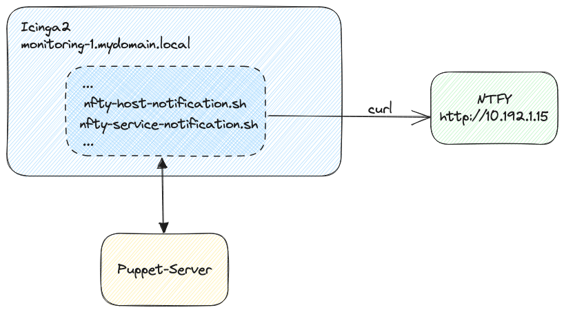
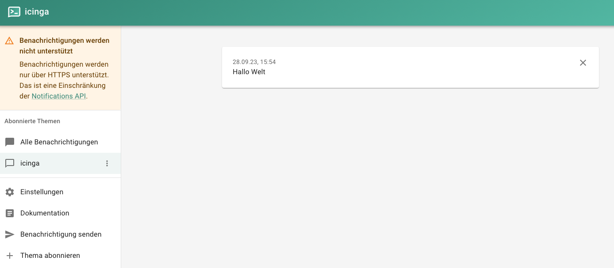
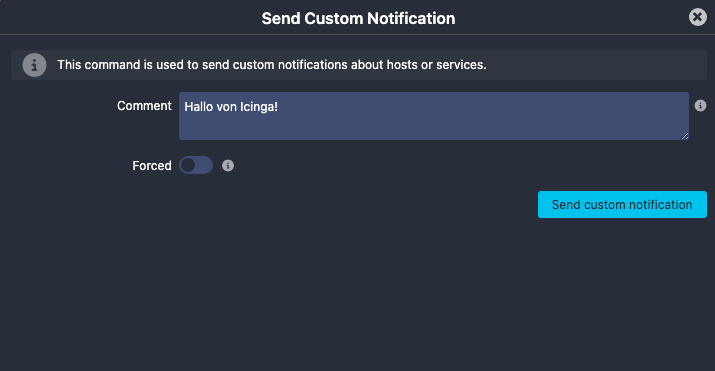
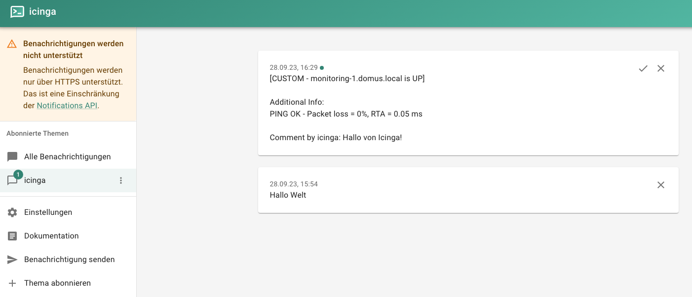

# Notifications mit Icinga2 & NTFY

[TOC]

## Einleitung
Falls ein Server oder ein wichtiger Dienst ausfällt, ist es notwendig, dass die zuständigen Personen schnellstmöglich am Smartphone informiert werden.
In diesem Beispiel verwenden wir [Icinga2](https://icinga.com/) für die Serverüberwachung und [NTFY](https://ntfy.sh/) für die Benachrichtigung.
Mithilfe von eigener Notification-Scripte, sollen die Benachrichtigungen von Icinga2 an NTFY übergeben. Um die Einrichtung dieses System zu automatisieren,
wird [Puppet](https://www.puppet.com/) verwendet.

<figure markdown>
  
</figure>

## Voraussetzungen
- Icinga2 ist [installiert und konfiguriert](/monitoring/icinga/)
- NTFY ist [installiert und konfiguriert](https://docs.ntfy.sh/install/)
- Puppet-Server ist [installiert und konfiguriert](/iac/puppet/create_puppet_server)
- Icinga2-Host ist als [Puppet-Client registriert](/iac/puppet/register_client)
- Alle Server befinden sich im selben Netzwerk

## Github
Die gesamte Infrastructure-As-Code befindet sich in meinem Github Repository [puppet-icinga-ntfy](https://github.com/andrekloster/puppet-icinga-ntfy)

## Konfiguration

### Nachricht an NTFY übergeben
Um im Allgemeinen eine Nachricht an NTFY zu übergeben, muss folgender Befehl ausgeführt werden:

```shell
curl -d "Hallo Welt!" http://<NTFY-SERVER>:<NTFY-PORT>/<NTFY-TOPIC>
```

In einem konkreten Fall würde eine solche Nachricht so aussehen:

```shell
curl -d "Hallo Welt!" http://10.192.1.15/icinga
```

Als HTTP Respone erhalten wir:

```json
{"id":"tzwMB0X8nqrm","time":1695909298,"expires":1695952498,"event":"message","topic":"icinga","message":"Hallo Welt"}
```

Sobald die Nachricht an NTFY übergeben wurde, wird diese an alle registrierten Clients weitergeleitet.

<figure markdown>
  
</figure>

### Icinga2 Notification-Script
Um nun via Icinga2 eine Nachricht an NTFY zu übergeben, muss ein Notification-Script für die Hosts und die Services erstellt werden.
Diese Scripte werden von Icinga2 aufgerufen, sobald ein Host oder ein Service einen Statuswechsel durchläuft. Puppet legt diese Scripte im Verzeichnis 
`/etc/icinga2/scripts/` ab. Die darin verwendeten Variablen werden von Icinga2 zur Verfügung gestellt. Im folgenden Beispiel wird das Script für die Host-Notifications:

```bash
#!/bin/sh

# Host Notification
template=$(cat <<TEMPLATE
[${NOTIFICATIONTYPE} - ${HOSTDISPLAYNAME} is ${HOSTSTATE}]

Additional Info:
${HOSTOUTPUT}
TEMPLATE
)

if [ ! -z "${NOTIFICATIONCOMMENT}" ]
then
    template="${template}

Comment by ${NOTIFICATIONAUTHORNAME}: ${NOTIFICATIONCOMMENT}"
fi

/usr/bin/curl -i --silent --output /dev/null \
    -d "${template}" "http://${NTFY_IP}/icinga"
```

### Icinga2 Command
Damit Icinga2 die Notification-Scripte aufrufen kann, müssen diese als Commands registriert werden. Zusätzlich definiert das Command auch die Umgebungsvariablen,
die an das Script übergeben werden.
Dazu wird in der Datei `/etc/icinga2/conf.d/commands_ntfy.conf` folgender Code eingefügt:

!!! note
    Die Variable `NtfyIp` wird von Puppet zur Verfügung gestellt und enthält die IP-Adresse des NTFY-Servers.
    Mithilfe von Puppet definieren wir diese Variabel unter `/etc/icinga2/constants.conf`

```
object NotificationCommand "ntfy-host-notification" {
  command = [ ConfigDir + "/scripts/ntfy-host-notification.sh" ]

  env = {
    NTFY_IP = NtfyIp
    NOTIFICATIONTYPE = "$notification.type$"
    HOSTDISPLAYNAME = "$host.display_name$"
    HOSTSTATE = "$host.state$"
    HOSTOUTPUT = "$host.output$"
    NOTIFICATIONAUTHORNAME = "$notification.author$"
    NOTIFICATIONCOMMENT = "$notification.comment$"
    HOSTDISPLAYNAME = "$host.display_name$"
  }
}

# usw.
```

### Icinga2 Notification
Anschließend kann ein Notification-Objekt erstellt werden, welches die Notification-Scripte aufruft.
Im folgenden Beispiel wird das Notification-Objekt für die Host-Notifications:

```
template Notification "ntfy-host-notification" {
  command = "ntfy-host-notification"

  states = [ Up, Down ]
  types = [ Problem, Acknowledgement, Recovery, Custom,
            FlappingStart, FlappingEnd,
            DowntimeStart, DowntimeEnd, DowntimeRemoved ]

  vars += {
    notification_logtosyslog = false
  }

  period = "24x7"
}

apply Notification "ntfy-icingaadmin" to Host {
  import "ntfy-host-notification"
  user_groups = host.vars.notification.ntfy.groups
  users = host.vars.notification.ntfy.users

  assign where host.vars.notification.ntfy
}

# usw.
```

### Icinga2 Host
Damit die Host-Notifications funktionieren, muss das Notification-Objekt dem Host zugewiesen werden.
Dazu wird in der Datei `/etc/icinga2/conf.d/hosts.conf` folgender Code eingefügt:

```
# usw.

vars.notification["ntfy"] = {
  groups = [ "icingaadmins" ]
}

# usw.
```

## Puppet
Damit die Konfiguration von Icinga2 automatisiert werden kann, wird Puppet verwendet. Dazu klonen wir das Beispiel-Repository von Github:

```shell
git clone https://github.com/andrekloster/puppet-icinga-ntfy.git
```

!!! warning
    Die Datei `puppet-icinga-ntfy/manifests/monitoring-1.pp` muss ggf. umbenannt werden, damit sie mit dem Hostnamen des Icinga2-Hosts übereinstimmt.

Anschließend passen wir die Datei `puppet-icinga-ntfy/manifests/monitoring-1.pp` an:

```puppet
node 'monitoring-1.mydomain.local' { # NODE ANPASSEN
    class {
        '::monitoring':
            ntfy_ip => '10.192.1.15' # IP ANPASSEN
        ;
    }
}
```

## Ausführung
Wenn die Konfiguration abgeschlossen kann in Icinga2 eine Test-Notification ausgelöst werden, die an NTFY übergeben wird.

<figure markdown>
  
</figure>

<figure markdown>
  
</figure>